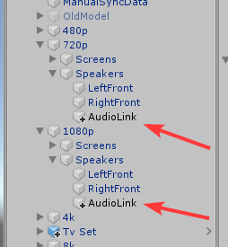
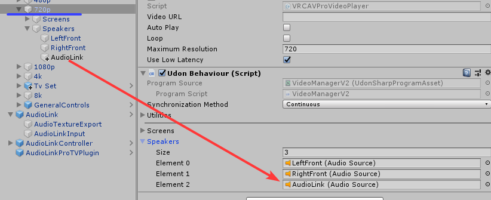

# AudioLinkAdapter Plugin for ProTV

### Instructions
Prerequisites:
- ProTV 2.0 or later
- AudioLink 0.2.5 or later 0.2.x version

Steps:
- Add the AudioLinkPlugin prefab from this folder into the scene, doesn't matter where.
- In the inspector, connect up your desired ProTV and AudioLink instances into the respective reference slots.
- In the ProTV hierarchy, decide what speaker you want to be used by AudioLink. The example scene uses an extra speaker named "AudioLink" for it. So you can do that if you want:  

- If you make a new speaker (like the demo scene has), do the same for all video player options you want the TV to connect with AudioLink. (eg: 480, 720, 1080, 4k and 8k all have 'AudioLink' speakers)
    - Also, be sure to add it into the speakers array on the VideoManager node like this:  

- If you want AudioLink to react to audio around the world even if you can't hear it (being outside of a volumetric audio area) ensure that the desired AudioLink audio sources are set to 2D:  

- Make sure that the game objects for each of the speakers being used for audio link have the EXACT same name. Then in the AudioLinkPlugin prefab in scene, make sure the `Speaker Name` field is the same.  

- Build & Test to make sure everything works.