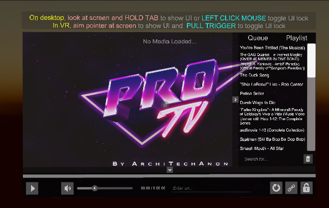
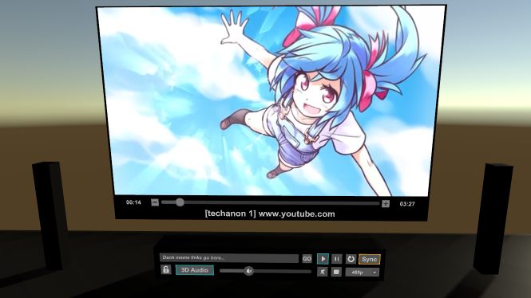
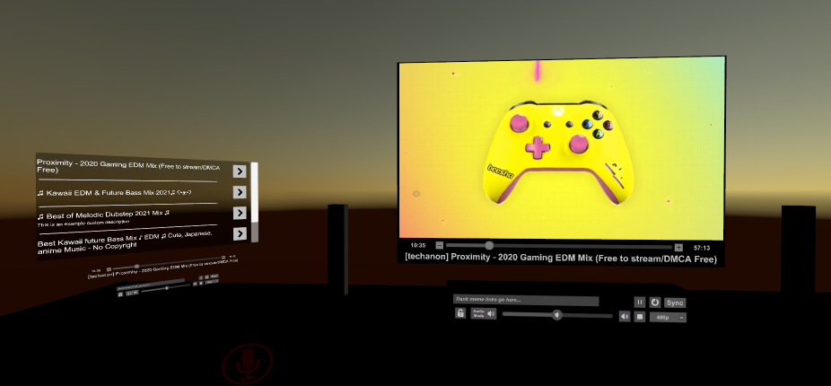
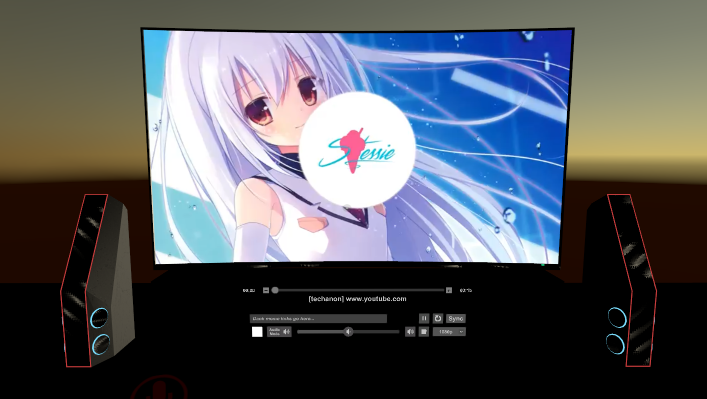
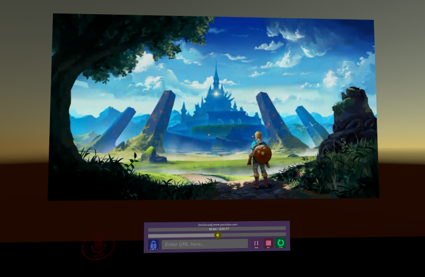
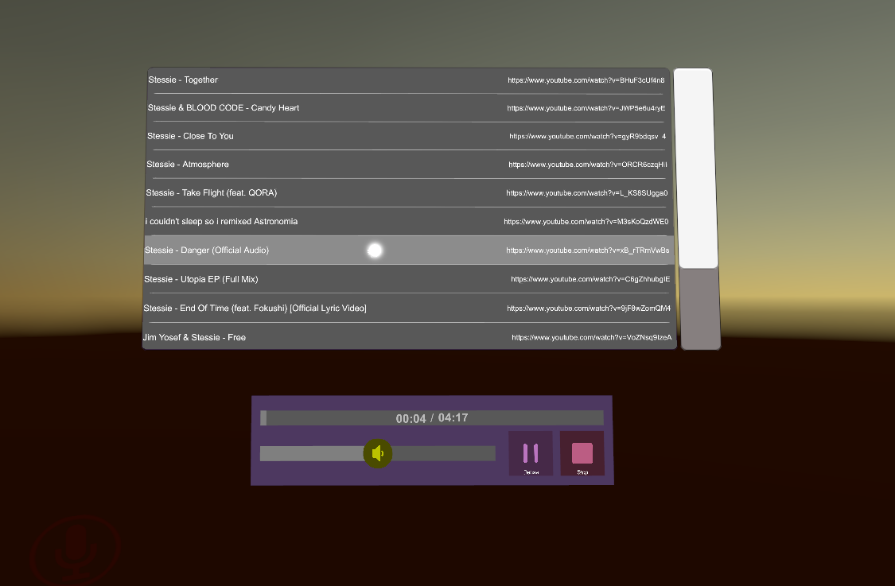

# Ready-made off-the-shelf TVs

## SUPPORT ME!

### Composite Controls Prefab
This plugin is wholy new UI designed to sit in front of the tv screen. It uses animations for visibility and add parts of the Generic Controls with a combination panel of a Queue and a Playlist with a more minimalist visual style.

Here's what it looks like:

## ProTV Standard Multi-Res
This prefab is the standard, well-known setup brought over from the 1.x series. It contains the TV2.0 Base and the General Controls plugin.

Here's what it looks like:  

## ProTV Multi-Subscriber Exmaple
This prefab is a variation on the standard, and mostly provided as a learning example on how to hook up multiple modules to a single TV. This prefab also features two additional video players to swap between: A multi screen player (one big screen with two smaller screens to the sides), and an implementation of the default Unity player (as opposed to the usual AVPro backend).

Here's what it looks like:  

## ProTV Custom Model
This prefab is a variable on the standard, but features a custom TV model instead of the old box/quad primitives setup from 1.x. Each of the screen meshs are updated to the TV's screen mesh for seemless positioning. It uses the General Controls plugin.

Here's what it can look like:  

## ProTV Slim (Recommended by Developer for Most Worlds)
This prefab is a model-less variation on the standard. It uses no "physical" models, just the screens. It comes with the Slim Controls plugin.

Here's what it looks like playing a video:  

## ProTV Music Player
This prefab is built like a music player, with sync disabled by default. It has all screens removed and features both the Slim Playlist and Minified Controls plugins.

Here's what it looks like:  

